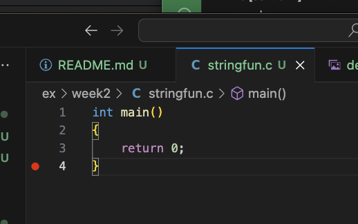
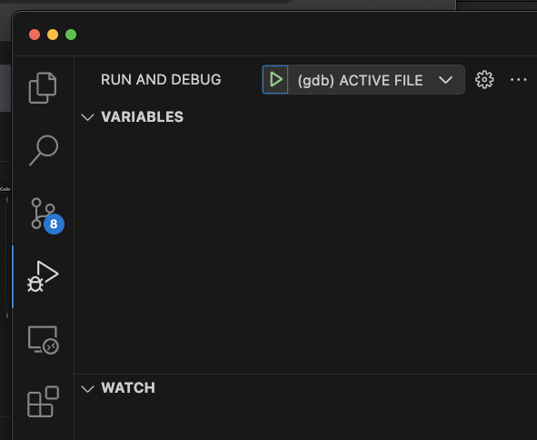
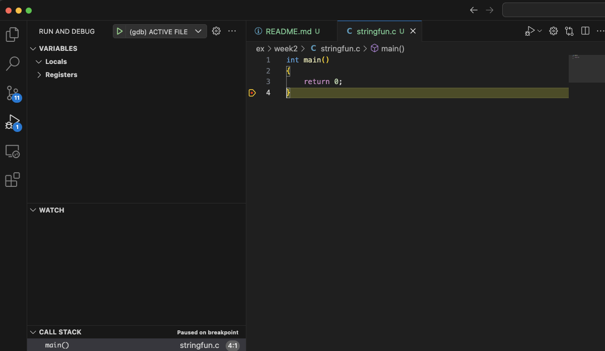
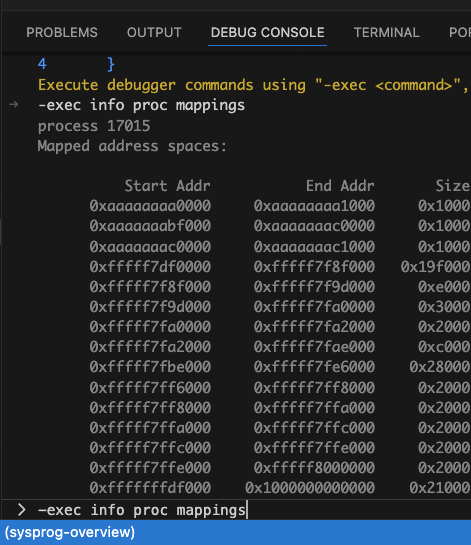

# universal makefile & vscode debug config

There two useful things in this folder:

1. Universal `makefile` - place this makefile **in the same folder as your *.c files** - it will discover and build each *.c file
2. Universal `make` build + `gdb` integrated debugging in vscode (see instructions below on how to use)

# universal makefile instructions

- copy `makefile` from this folder to the folder that contains your code
- for example, if your code path is `cs503/week2/stringfun.c`, place `makefile` in `cs503/week2`
- in the integrated terminal, `cd` into the folder with your code and run `make`

# universal gdb debugging - setup

- your code folder needs the makefile described above - do that first
- you need make, gcc, gdb - if they are not found run `sudo apt update && sudo apt install make gcc gdb -y`
- copy the two files from `.vscode/` in this folder (`launch.json` and `tasks.json`) into `.vscode/` **in the root of your vscode worksapce**
- for example, using the same example above for `cs503/week2`, you would place these files in `cs503/.vscode`
- if the `.vscode` folder does not exist, create it
- **IMPORTANT** - note there is a `.` at the beginning of the folder name

# universal gdb debugging - how to use it

- **IMPORTANT** you must open the file you want to debug in the editor
- for example, if I want to debug `cs503/week2/stringfun`, I open `cs503/week2/stringfun.c` in the vscode editor
- **IMPORTANT** set a breakpoint, it should look like this:

Now open the debug panel from the left navigation, you should see an option to debug the active file:

Hit the play button, now you should actively be debugging your app and you are able to use the integrated features in vscode:

Pro tip: you can also enter commands to `gdb` directly using the debug console; all commands must start with `-exec` (that's one dash only)

Example: running info proc mappings:

